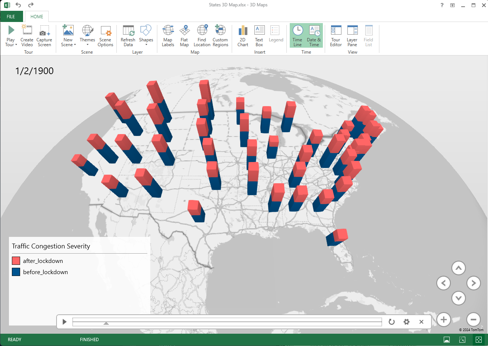

# CIS 4560 Bigdata Project

| Group 2              |                      |                      |                      |                      |
|:---------------------|:---------------------|:---------------------|:---------------------|:---------------------|
| Ethan Cheng          | John Haavardsen      | Nemesio Merales      | Alex Monita-Guzman   | Zichen Xue           |

## Abstract
This project will present an analysis of traffic congestion patterns in the Contiguous United States before and after the COVID-19 shutdowns, focusing on data manipulation and analysis techniques. The study will leverage a large 12GB dataset spanning from February 2016 to September 2022, comprising over 33 million recorded congestion events across the United States. The analysis involves temporal segmentation of the dataset into pre-COVID and post-COVID periods, followed by the calculation and comparison of congestion metrics. The project will utilize Hadoop and Hive for data handling and cleaning processes and Excel and Power BI for data analysis and visualization. The results from this study will offer insights into transportation planning and policy-making efforts surrounding events like large-scale shutdowns. 

## Dataset Source
US Traffic Congestions (2016-2022) 12.88 GB 

https://www.kaggle.com/datasets/sobhanmoosavi/us-traffic-congestions-2016-2022

## Metadata
| Data Point | Description |
|:-------|:---------|
| **ID** | Event ID |
| **Severity** | Severity of event, as reported by the main data provider, is rated on a scale from 0 to 4, with 0 being the least severe. |
| **Start_Lat** | Approximate latitude coordinate of the congestion event. |
| **Start_Lng** | Approximate longitude coordinate of the congestion event. |
| **StartTime** | Approximate start time of the congestion event, given in the local timezone. |
| **EndTime** | Approximate end time of the congestion event, given in the local timezone.  |
| **Distance (mi)** | The length of the road extent affected by the congestion event, measured in miles. |
| **DelayFromTypicalTraffic (mins)** | Delay compared to typical traffic flow (in minutes) due to the congestion event, as reported by the provider. |
| **DelayFromFreeFlowSpeed  (mins)** | Delay compared to free traffic flow (in minutes) due to the congestion event, as reported by the provider. |
| **Congestion_Speed** |  The categorically ranked speed of traffic impacted by the congestion, as reported by the provider. |
| **Description** | Text description |
| **Street** |  |
| **City** |  |
| **County** |  |
| **State** |  |
| **Country** |  |
| **ZipCode** |  |
| **LocalTimeZone** |  |
| **WeatherStation_AirportCode** |  |
| **WeatherTimeStamp** |  |
| **Temperature** |  Fahrenheit |
| **WindChill** |  Fahrenheit |
| **Humidity** |  % |
| **Pressure** | inches |
| **Visibility** | miles |
| **WindDir** |  |
| **WindSpeed** | miles per hour  |
| **Precipitation** | inches |
| **Weather_Event** |  |
| **Weather_Conditions** |  |
|        |          |

# Process
1. Temporal Segmentation: Divide the dataset into two segments: pre-COVID period and post-COVID period. The pre-COVID period could be defined as the time period before the implementation of widespread COVID-19 shutdowns and restrictions, while the post-COVID period could be defined as the time period after these measures were implemented. 

2. Congestion Metrics Calculation: Calculate relevant congestion metrics for each segment, such as: 

   [x] Average congestion severity: Calculate the average severity of congestion events (e.g., 	severity column) for each segment. 

   [ ] Total congestion duration: Calculate the total duration of congestion events (e.g., using StartTime and EndTime columns) for each segment. 

   [ ] Congestion frequency: Count the number of congestion events for each segment. 

   [ ] Delay metrics: Calculate average delay times (e.g., DelayFromTypicalTraffic and DelayFromFreeFlowSpeed columns) for each segment. 

3. Comparison Analysis: Compare the congestion metrics between the pre-COVID and post-COVID periods to identify any significant differences or trends: 

   [x] Severity comparison: Determine if there are differences in the severity of congestion events before and after the COVID-19 shutdown. 

   [ ] Duration comparison: Analyze if there are changes in the total duration or frequency of congestion events between the two periods. 

   [ ] Delay comparison: Compare average delay times before and after the COVID-19 shutdown to assess changes in travel times and congestion impacts. 

4. Visualization: Visualize the congestion metrics using charts, graphs, or 3D maps to effectively communicate the findings of our analysis. We will create time series plots showing congestion trends over time, comparing congestion metrics between the pre-COVID and post-COVID periods, or spatial maps illustrating changes in congestion patterns across different regions. 

5. Statistical Analysis: Conduct statistical tests, such as t-tests to determine if the observed differences in congestion metrics between the two periods are statistically significant.

By analyzing the amount of congestion before and after the COVID-19 shutdown using this approach, we can gain insights into how the pandemic and associated measures impacted traffic patterns, congestion levels, and travel behaviors. This analysis could provide valuable information for transportation planning, policy-making, and infrastructure management efforts. 


# Tutorial
## Pre Processing

This original dataset contained hourly data for years 2016-2022, but we want to segment the data between two years before and prior to the COVID-19 lockdown. 

To prune the 12GB csv file we use the following grep command to generate a new file containing data within our analysis range.

```bash
grep -E '(,2018-|,2019-|,2020-|,2021-)' us-traffic-congestions-2016-2022.csv > congestion_18_21.csv
```
## Dataset Preparation

The dataset in this repository has already been filterd. Begin by connecting to your remote linux node via ssh. 

```bash
ssh [username]@server_ip
```
Use the following terminal commands to download and extract the dataset.

```bash
wget -O congestion_18_21.tar.gz https://github.com/sphandro/bigdata-project/raw/main/dataset/congestion_18_21.tar.gz
```

```bash
tar -xzf congestion_18_21.tar.gz
```
 uncompress file, the resulting file is about 9.15GB


## Create HDFS directory
```bash
hdfs dfs -mkdir congestion
hdfs dfs -put congestion.csv congestion
hdfs dfs -ls congestion
hdfs dfs -mkdir congestion_by_month_year
```
## HiveQL 
```sql
use [username];

DROP TABLE IF EXISTS congestion;

CREATE EXTERNAL TABLE IF NOT EXISTS congestion(
   id STRING,
   severity TINYINT,
   start_Lat DOUBLE,
   start_Lng DOUBLE,
   startTime STRING,
   endTime STRING,
   distance DOUBLE,
   delayFromTypicalTraffic TINYINT,
   delayFromFreeFlowSpeed TINYINT,
   congestion_Speed STRING,
   description STRING,
   street STRING,
   city STRING,
   county STRING,
   state STRING,
   country STRING,
   zipCode INT,
   localTimeZone STRING,
   weatherStation_AirportCode STRING,
   weatherTimeStamp STRING,
   temperature TINYINT,
   windChill TINYINT,
   humidity TINYINT,
   pressure DOUBLE,
   visibility TINYINT, 
   windDir STRING,
   windSpeed TINYINT,
   precipitation TINYINT,
   weather_Event STRING,
   weather_Conditions STRING )
ROW FORMAT DELIMITED 
FIELDS TERMINATED BY ','
STORED AS TEXTFILE LOCATION '/user/[username]/congestion';
```
Create smaller table to hold only record attributes needed for analysis based on the congestion table

```sql
CREATE TABLE IF NOT EXISTS congestion_slim 
AS SELECT
    severity,
    state,
    month(substring(startTime, 0, 10)) AS month,
    year(substring(startTime, 0, 10)) AS year,
    CASE
        WHEN year(substring(starttime,0,10)) < '2020' THEN 'before_lockdown'
        ELSE 'after_lockdown'
    END AS lockdown_period
FROM
    congestion;
```
Our dataset contains hourly records accross the united states. Grouping by state, month, year and lockdown_period helps reduce the results further. Finally we calculate average congestion severity by state, month and lockdown_period.

```sql
INSERT OVERWRITE DIRECTORY '/user/amonita/congestion_state_month'
ROW FORMAT DELIMITED FIELDS TERMINATED BY ','
SELECT
    state,
    month,
    lockdown_period,
    AVG(severity) AS avg_congestion_severity
FROM
    congestion_slim
GROUP BY
    state,
    month,
    lockdown_period;
```
This generates many files in the HDFS directory congestion_state_month/
```
/congestion_state_month/000000_0
/congestion_state_month/000002_0
/congestion_state_month/000003_0
/congestion_state_month/........
```

## Linux Node

Transfer files from HDFS to linux node

```bash 
hdfs dfs -get congestion_by_month_year/*
```

 Concatinate files into a new csv file and remove extra files
 
```bash 
cat 000* > congestion_data.csv
rm 000*
```
Add column titles to facilitate excel import

```bash
 echo 'state,month,year,lockdown_period,avg_severity'$'\n'"$(cat congestion_data.csv)" > congestion_data.csv
```
### Windows GitBash
```bash 
scp [username]@[server_ip]:/home/[username]/congestion_data.csv congestion_data.csv
```
### Excel 3D Map
- Open Excel and import congestion_data.csv data
- Select *month* column and format cells to Date format
- Save Excel file as *.xlsx*
- Select 3D Map from Insert tab
- Set the following:
    - **Location**: state
    - **Height**: avg_severity
    - **Category**: lockdown_period

## Result
